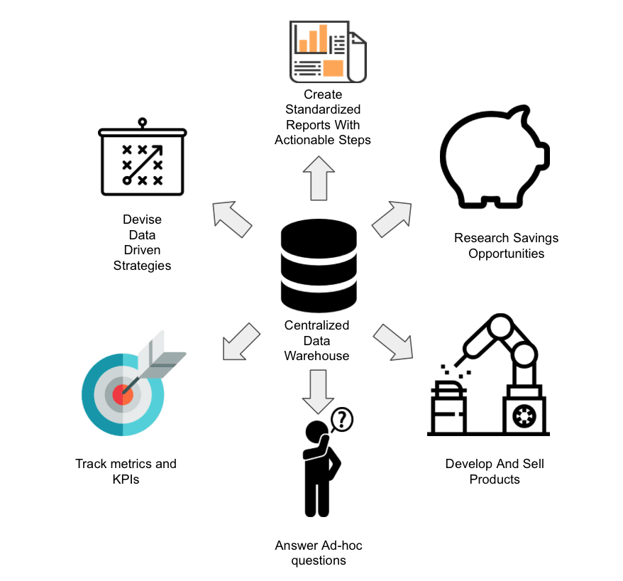

## Implementação de um Data Warehouse no Amazon Redshift

##### O objetivo deste projeto é a criação e carga de um data warehouse no Amazon Redshift. Para tanto utilizou-se uma fonte de dados genérica e uma conta free trial na AWS.
##### Para a carga de dados utilizou-se o SQL Workbench/J.

##### O procedimento de criação do DW no Redshift está explicado na documentação (arquivo 01-Implementação de um DW no AWS Redshift.pdf).

##### As cargas de dados foram feitas de três maneiras diferentes:
##### 1. Em batch
##### 2. Em paralelo
##### 3. Através de uma arquivo json

##### O objetivo do presente trabalho é a familiarização do ambiente em nuvem e observar como o processo de criação e carga de dados é simplificado quando comparado a um DW on-premise.
